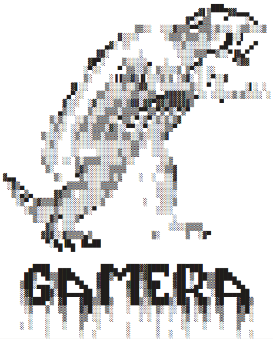
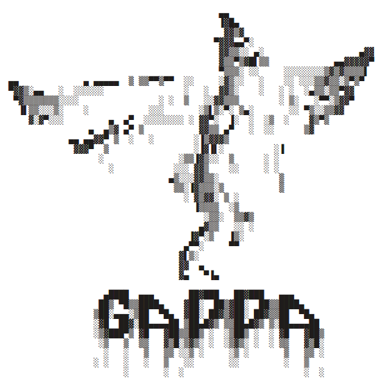

  
  
  

# GAMERA

is a project launched by the [Max Planck Insitute for Nuclear Physics in Heidelberg (MPIK)](https://www.mpi-hd.mpg.de/mpi/en/),
an open-source C++/python package which handles the spectral modelling of non-thermally emitting astrophysical sources in a simple and modular way. It allows the user to devise time-dependent models of leptonic and hadronic particle populations in a general astrophysical context (including SNRs, PWNs and AGNs) and to compute their subsequent photon emission. 

For more info and a turorial, see the [GAMERA docu!](http://libgamera.github.io/GAMERA/)
(currently being updated)

GAMERA is written in C++ and can be wrapped to python.

The software is listed in the Astrophysics Source Code Library 

Quick Start
===========

Dependencies
------------

You need to have [GSL](http://www.gnu.org/software/gsl/) installed on your
system, as well as [SWIG](http://www.swig.org/) if you want to wrap the 
python module. If you are a Mac user, it might be required to install
[pkg-config](https://www.freedesktop.org/wiki/Software/pkg-config/).

Building
--------

Running

 - $ make all

will generate a shared object (lib/libgamera.so) as well as the python module
(lib/_gamerapy.so , lib/gamerapy.py).

