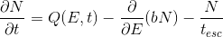

[(back to main page)](main_page.md)

General info
============

`GAMERA` is a `C++` library for modeling in high energy astrophysics. It is also
available as a `swig`-wrapped `python` module (which is internally called `gappa`).

Here is a list of what you can do with it:
- calculate the spectral evolution of a particle population in the presence of
  time-dependent or constant injection, energy losses and particle escape
- calculate the radiation spectrum from a parent particle population
- do these things in an object-oriented and modular way, allowing you to easily
  model multiple emission zones that can interact with each other
- access 3D Galactic gas, magnetic field and spiral arm models, as well as hydrodynamical
  Supernova Remnant models from accepted and peer reviewed publications

And here are some things that you can't do at the moment:
- fitting
- spatial evolution of particles. However, it is possible to approximate by using
  different zones of particles

How to use these features is shown in the [tutorials section](tutorials_main.md).
 
At the time of writing, `python` is quite popular and the tutorials on these pages 
are provided in that language. However, you can use `GAMERA` also in your `C++` program
by adapting the syntax, e.g. instead of the `python` code
```
fr = gappa.Radiation()
fr.SetBField(b)
[...]
sed = fr.GetTotalSED()
```
you could write in `C++` syntax
```
Radiation *fRad = new Radiation();
fRad->SetBField(b);
[...]
vector< vector<double> > SED = fRad->GetTotalSED();
```
Please check out the [installation instructions](download_installation.md) to learn how to make `GAMERA` work
in either language.


Particle evolution
==================

The intention of `GAMERA` is to make the modeling of particle spectra in typical 
scenarios relavant to gamma-ray astronomy as simple as possible.
 
The `Particles` class is designed to solve the following transport equation
 

 
where _Q(E,t)_, the source term, is the spectrum of particles injected into a system, 
_b=b(E,t)_ is the energy loss rate of these particles, _t<sub>esc</sub>_=_t<sub>esc</sub>(E,t)_ is the time 
scale on which particle escape the system and _N_=_N(E,t)_ is the total resulting 
particle spectrum in the system at a time _t_. 

An example which is described by this equation could be a pulsar wind nebula (PWN) 
where the pulsar steadily injects a spectrum of accelerated electrons / positrons into 
the surrounding medium, where these particles suffer Synchrotron- and other losses 
over time.
 
If the energy loss rate and escape time scale are constant in time, _b=b(E)_ and  _t<sub>esc</sub>=t<sub>esc</sub>(E)_, 
the differential equation can be solved analytically or semi-analytically. 
An excellent discussion of this solution can be found in [Atoyan & Aharonian 1999](http://adsabs.harvard.edu/abs/1999MNRAS.302..253A).
 
If the losses and escape times are time-dependent, typically the equation can only be solved 
numerically. The approach in `GAMERA` is to interpret the transport equation as an 
advective flow in energy space and solve it using a donor-cell advection algorithm.
 
This method also allows for iterative models, because model parameters can be 
changed while the numerical method is running. This allows for example for the interaction between 
particles and their emitted radiation, or between multiple zones of particles.

Per default, the numerical method will be used. However, if the user is sure that
energy losses are constant in time, the semi-analytical method can be applied, 
which in certain circumstances can be much faster. However, the latter does presently
not support the treatment of particle escape.

The output of this class, namely particle spectra _N(E,t)_, is in the right format 
to be directly used in the `Radiation` class, so that radiation spectra can be calculated easily. 


Radiation models
================

In `GAMERA`, radiation mechanisms are implemented for
- Electrons (including Positrons)
- Protons 
- Arbitrary mix of hadronic species for both projectiles and target nuclei. 

Supported gamma-ray production mechanisms:

### for Electrons

- Synchrotron Emission
  - isotropised pitch angle distribution of electrons [(following Ghisellini et al. 1988)](http://adsabs.harvard.edu/abs/1988ApJ...334L...5G) 
  - custom fixed pitch angles [(see e.g. Blumenthal & Gould 1970)](http://adsabs.harvard.edu/abs/1970RvMP...42..237B)

- Bremsstrahlung
  - Both electron-electron and electron-ion Bremsstrahlung [(following Baring et al. 1999)](http://adsabs.harvard.edu/abs/1999ApJ...513..311B)

- Inverse-Compton Emission 
  - using the full Klein-Nishina cross-section [(see e.g. Blumenthal & Gould 1970)](http://adsabs.harvard.edu/abs/1970RvMP...42..237B)
  - allowing for arbitrary target field spectra
  - supporting synchrotron-self-Compton(SSC) emission [(using Atoyan & Aharonian 1996)](http://adsabs.harvard.edu/abs/1996MNRAS.278..525A)
  - anisotropic radiation fields for anisotropic electrons [(following Moskalenko & Strong 2000)](http://iopscience.iop.org/article/10.1086/308138/meta)
  - anisotropic radiation field for isotropic electrons [(following Aharonian & Atoyan 1981)](https://ui.adsabs.harvard.edu/abs/1981Ap%26SS..79..321A/abstract)

### for Hadrons

- π⁰- and η-Decay
  - Following the parameterisation of [Kafexhiu et al. 2014](http://adsabs.harvard.edu/abs/2014PhRvD..90l3014K)
 

Data Types
==========

`GAMERA` uses __doubles__, __vectors of doubles__, __vectors of double-tuples__ and __2D vectors of doubles__.
- __doubles__ (`double`) are used as input / output when a single number is supplied / extracted,
  e.g. when the distance to a source is set or when the total energy of particles
  is extracted.
- __vectors of doubles__ (`vector<double>`) are used for example when you want to calculate the radiation spectrum
  at a series of specific points in energy, which are supplied in this format.
  If you generate a string of random numbers with the `Utils`-class, you can specify
  the number of random numbers you want to dice and it will return you the result as
  a 1D-vector of doubles
- __vectors of double-tuples__ (`vector< vector<double> >`) are frequently used when a function or lookup is provided / extracted,
  for example 
  - SEDs and spectra are 2D vectors holding tuples of (energy,flux)
  - the time dependency of the source size is supplied in form of a vector of tuples
    (time,size)
  - the energy dependency of the particle escape term can be provided in the format
    of (energy, escape_time)
- __2D vectors of doubles__ (`vector< vector<double> >`) consisting of longer vectors are used e.g. for
  - probability density surfaces in random number generation
  - time-and energy dependent shapes of particle escape of injection spectra

If you use `python` and `numpy`, you can conveniently cast the `GAMERA` output
into `numpy`-arrays for further manipulation. Also, `GAMERA` accepts `numpy`-arrays
as input. In particular, `numpy.meshgrid` can be used as input for the last bullet point
in the above list.


Units 
=====

Units in `GAMERA` are mostly in cgs, with several exceptions that are meaningful
in the astrophysical context.

- times are in years, except for particle escape time scales
- lengths are in parsecs
- when retrieving SEDs, for convenience the units are
  - erg / s / cm<sup>2</sup> vs TeV for radiation flux SEDs
  - erg / s vs. TeV for luminosity SEDs (i.e. when the distance to the source is not set)
  - erg vs. TeV for particle SEDs

  (differential spectra are again in cgs units)
- gas densities are in number densities. 


Also, the units of the spectrum will impact the unit of the calculated radiation spectra.
For instance, if the unit of the particle spectrum is only differential in energy, 
i.e. 1/erg, the output radiation spectra will have the unit of a flux if a 
source distance is specified (see below) or differential photon count per energy and time if not. 

On the other hand, if the input unit is differential also in volume, i.e. 1/erg/cm<sup>3</sup>, 
then also the output radiation spectrum will be. Therefore, if no distance is 
specified in this case, a volume photon emissivity will be calculated, i.e. d<sup>3</sup>N/dEdVdt. 

Libraries
=========

`GAMERA` uses 
- the `C++` Standard Library, mainly for output stream and vectors
- `GSL` for interpolation, integration and random number generation


[(back to main page)](main_page.md)


