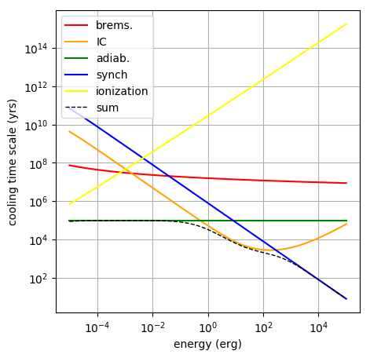

[(one page up)](tutorials_main.md)

How to View the Time-Scales of the Relevant Cooling Processes
=============================================================

Sometimes it is important to know the cooling time scale of electrons
due to different energy-loss mechanisms. 
This information is available through the `Particles`-class function
`GetCoolingTimeScale()`, here's how:


## Step 1: create and set up a Particles-object
By default, when creating the Particles class, it is assumed that you want electrons. The following example covers the electron case.
Depending on the environment we are setting up, the following losses are available:
 - adiabatic losses (if expansion velocity is given)
 - synchrotron losses (if magnetic field is given)
 - Bremsstrahlung losses (if density of the ISM is given. _Assumes proton only composition!!!_)
 - Ionization losses (if density of the ISM is given. _Assumes protons and 10% Helium!!!_)
 - Inverse Compton losses (if at least one target radiation field is given)
 
Note: We are aware of some inconsistencies that are present at the moment and they will be fixed (also wrt the treatment in the Radiation class).

```
import gappa as gp
fp = gp.Particles()
# set up particle spectrum with random environmental parameters
fp.AddThermalTargetPhotons(10,10*gp.eV_to_erg)
fp.SetAmbientDensity(1)
fp.SetRadius(1)
fp.SetExpansionVelocity(1e9)
fp.SetBField(5e-6)
fp.SetAge(1e5)
```

## Step 2: Use the GetCoolingTimeScale() function

```
# extract the cooling time scales at energy points 'e'
e = np.logspace(-5,5,150)
fp.GetCoolingTimeScale(e,"sum")
fp.GetCoolingTimeScale(e,"inverse_compton")
fp.GetCoolingTimeScale(e,"bremsstrahlung")
fp.GetCoolingTimeScale(e,"adiabatic_losses")
fp.GetCoolingTimeScale(e,"synchrotron")
fp.GetCoolingTimeScale(e,"ionization")
```

This will give you the cooling time scales at `t=age`. If you are interested
at the cooling time scales at different times, you can get that by specifying
at time `t` too, e.g.:

```
fp.GetCoolingTimeScale(e,"synchrotron",t)
```

This [script](loss_times.py) will create the following
plot:



By the way, if you are interested in the energy loss rate, `dE/dt [erg/s]` instead of the 
cooling time scale, you can call the `fp.GetEnergyLossRate()` function with exactly the same syntax as above.

## If you have protons
If you want protons, in the initialization step, you need to add the line:

`fp.SetType("protons")`

In this case though the only losses that are accounted for are:
 - adiabatic losses
 - pp cooling (assuming only pp interactions)
 - ionization losses (assuming hydrogen and a 10% of helium)

