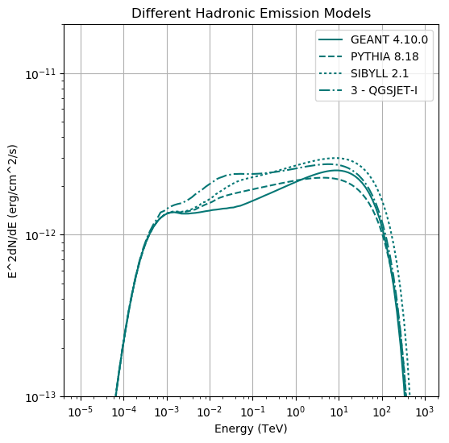

# How to specify the hadronic interaction model

`GAMERA` uses the parametrisation developed by [Kafexhiu](http://adsabs.harvard.edu/abs/2014PhRvD..90l3014K). In this work, four high energy emission 
models were accounted for, namely `GEANT 4.10.0`, `PYTHIA 8.18`, `SIBYLL 2.1` and `QGSJET-I`. 

In `GAMERA`, all these models can be used via the `PiModel` variable in the Radiation 
class. This variable can take integer value 0-3, which mean:
- PiModel = 0 -> GEANT 4.10.0 (DEFAULT)
- PiModel = 1 -> PYTHIA 8.18
- PiModel = 2 -> SIBYLL 2.1
- PiModel = 3 -> QGSJET-I

As indicated above, if not specified, the default model used in the calculation 
of gamma-ray spectra from hadrons is `GEANT 4.10.0`. 

The `PiModel` variable can be set via 

```
fr.SetPPEmissionModel(m) # SET THE EMISSION MODEL; m={0,1,2,3}
```

[Here](hadronic_emission_models.py)  is a documented, working python script which will produce the following plot: 

