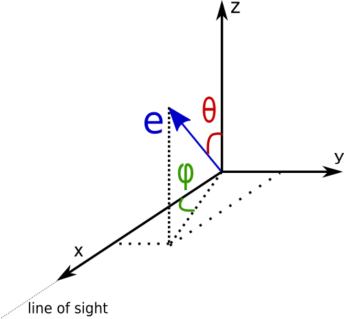
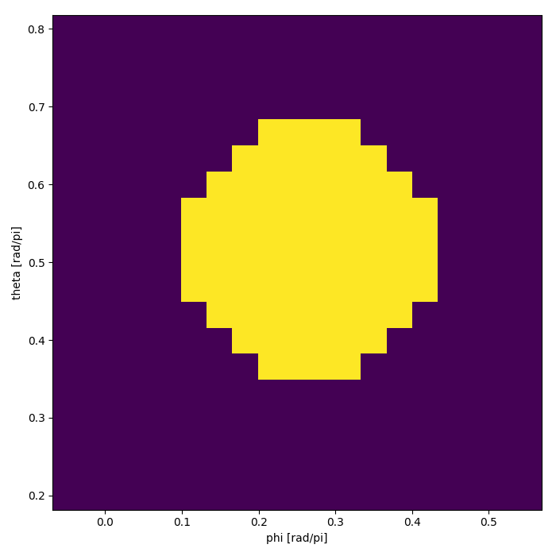
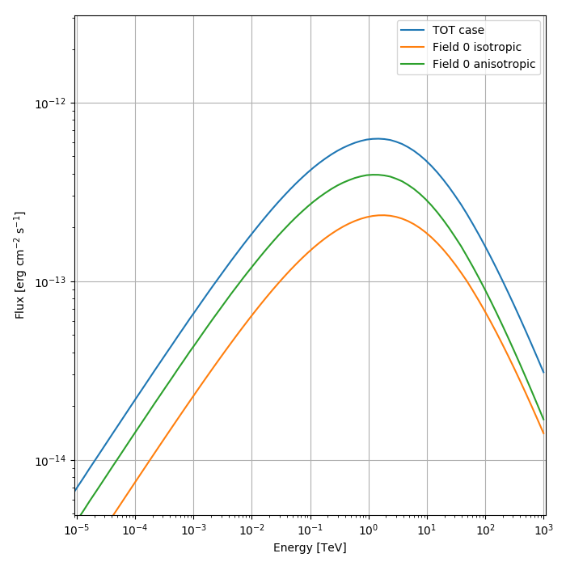
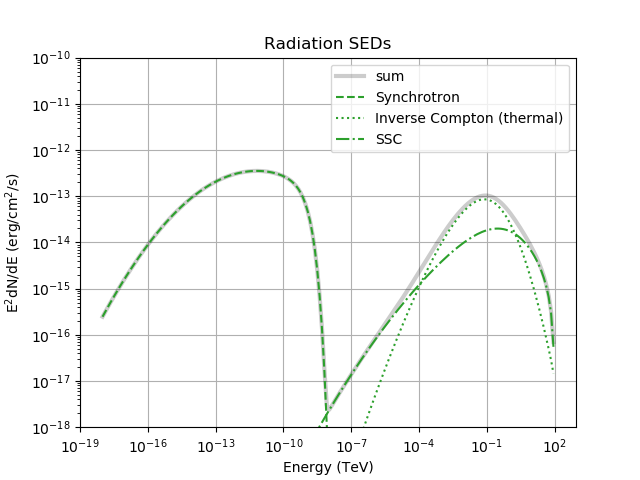

[(back to main page)](main_page.md)

[(one page up)](tutorials_main.md)

Inverse Compton Tutorial
========================

In this tutorial we will see in some more detail how to set up the radiation fields for the Inverse Compton scattering
for both isotropic and anisotropic case. In the following we assume that `fr` is an instance of the class `Radiation`.

GAMERA allows the user to add directly a thermal photon field knowing the temperature and the energy density through the
function:
```python
fr.AddThermalTargetPhotons(temperature,energy_density)
```
The units to be used are Kelvin degrees for the temperature and erg/cm<sup>3</sup> for the energy density.

For a more particular usage, it is also possible to add arbitrary photon fields via
```python
fr.AddArbitraryTargetPhotons(photon_array)
```
where `photon_array` is an array of tuples \(E,photon_density\) in units of `erg` vs `erg^-1 cm^-3`.

A further possibility is to import a photon field from a file with:
```python
fr.ImportTargetPhotonsFromFile(filename)
```
where the structure of the file must be `energy [eV]` vs `number density [cm^-3]`.
As for the other mechanisms, we have to compute the radiative output before accessing the Inverse Compton components.
We remind here to call the function
```
fr.CalculateDifferentialPhotonSpectrum(e)
```
where `e` is the energy range of the photon spectrum we want as a result.


Case 1: Isotropic photon fields
-------------------------------

Let's start with the simple case of a thermal photon field. In principle we can add multiple photon fields. In the default
case, when asking for the Inverse Compton component of the gamma ray spectrum, it will be computed on the sum of the
photon fields.
```python
fr.GetICSpectrum()  # IC spectrum for the sum of all the target photon fields.
fr.GetICSED()       # IC SED for the sum of all the target photon fields.
```
If instead we want to know what is the contribution of each target field to the total Inverse Compton spectrum, we have to
esplicitely specify that before filling the differential photon spectrum. This is done by calling the function
`fr.UnsetICFastMode()` that forces GAMERA to compute all the single Inverse Compton components.

```python
fr.UnsetICFastMode()
fr.CalculateDifferentialPhotonSpectrum(e)

fr.GetICSpectrum(0)  # IC spectrum for the target photon field 0
fr.GetICSED(0)       # IC SED for the target photon field 0
```


Case 2: Anisotropic photon fields
---------------------------------

In this section we will go through the steps to consider anisotropic fields.
The first step is to give an angular dependency to the target photon field. There are 2 possibilities:
 1. anisotropic beam of electrons
 2. isotropic distribution of electrons

Before going into the details of the 2 cases, here is the geometry used in GAMERA

In the following figure it is illustrated how the angles are defined together with the direction of the electrons \(in case 1.\)
and the direction of the line of sight \(always along the x-axis\)

 

so the phi angle goes from 0 to 2\*pi and the theta angle from 0 to pi.

If you work in python, the angular dependency can be implemented by filling a `numpy.meshgrid`:

```python
phi = np.linspace(1.,1.5,20)          # angles from 1 to 1.5 radiants divided in 20 bins
theta = np.linspace(0.5,1.,20)        # angles from 0.5 to 1 radiant divided in 20 bins
ph_m, th_m = np.meshgrid(phi, theta)  # defining the meshgrid
distr = fill_grid(ph_m,th_m)          # fill the meshgrid with a user defined function
```

The filled grid `distr` needs to be normalized over solid angle by the user \(see the example scripts\).
Once we have the angular distribution of the photon field, we can complete the geometry of the system.

### Anisotropic distribution of electrons

At the moment, this is the default case implemented in GAMERA. The full geometry of the IC scattering in this case is done
with the following function:
```python
fr.SetTargetPhotonAnisotropy(target, angles_e, phi, theta, distr)
```
where `target` is the index of the target field we want to make anisotropic, `angles_e` is an array `[phi,theta]` for
the direction of the electron beam and the other variables are the same as above.

At this point GAMERA will use the angular dependent cross section to compute the IC scattering and the results can
be explored with the previous methods (including the unsetting of the fast mode option to retrieve single components).

An example script that produces the plot below can be found [here](anisotropic_IC_scattering.py)

 


### Isotropic distribution of electrons

This is a rather recent addition to the code. In case we have an isotropic distribution of electrons, we can follow the same
steps as before additionally stating that our electrons are isotropically distributed:
```python
fr.SetElectronsIsotropic()
fr.SetTargetPhotonAnisotropy(target, angles_e, phi, theta, distr)
```
the first function will set an inner GAMERA variable so that the code will use an isotropic distribution of electrons.
The second function is exactly the same as before, but the variable `angles_e` will not actually be used in the calculations.
**WARNING:** currently this implementation is rather slow, so don't panic if your code takes long time to run. We will try to
speed up the computations.

At the moment the code does not allow to switch back from an isotropic distribution of electrons to an anisotropic one. We would recommend not to mix the two options and use only one of the possibilities at a time. Also in this case holds the same procedure to access single components of the Inverse Compton spectrum. The script linked above has also the line to set up the isotropic electrons needed for this case.

Synchrotron Self Compton process
--------------------------------

The Synchrotron Self Compton (SSC) process happens when the electrons the synchrotron radiation produced by the electron distribution becomes
itself a target photon field for inverse Compton processes. This type of process can become important in certain astrophysical scenarios like
AGNs and gamma-ray bursts.

*In GAMERA the emission from this process is taken into account in the radiation class (there is a tentative implementation to account for it
in the time evolution of the particles, but it is not covered here yet. It will come in a seprate tutorial).*

To compute the contribution of SSC to the total gamma ray spectrum, we have to add the synchrotron radiation as a target field and there is a set of
functions that can do this. Before going into the details of how to do this in GAMERA, we need clarify the assumptions that go into the calculations.
To correctly compute the SSC component, we need to know the number of upscattered photons. Given that GAMERA routines output a flux (or a luminosity)
for the synchrotron emission, it is needed to assume a certain volume of the emission region in order to know the number density of the target radiation.
In GAMERA the assumption is that of a homogeneous sphere with radius `R` (user-defined).

```C++
N = DifferentialEmissionComponent(E, p) * U / (4. * pi * R * R * c_speed);
```
where `DifferentialEmissionComponent(E, p)` is the synchrotron spectrum and `U` is a correction number arising from the fact that the entire volume
of the sphere contributes to the production of synchrotron radiation (see equations 15-17 of 
[this](https://ui.adsabs.harvard.edu/abs/1996MNRAS.278..525A/abstract) paper).

**SSC in GAMERA in practice**

Assuming you are using the python interface, obtaining the SSC spectrum is quite simple, but requires being careful with the order of the statements.
A basic example can be [this](radiation_sed_SSC.py) one (you can download a working script). In the following we illustrate the most important aspects:

```python
# Initialize the radiation class
fr = gp.Radiation() 
fr.SetBField(b_field)
fr.AddThermalTargetPhotons(t_1,edens_1)  # add a thermal field
fr.SetDistance(distance)
fr.SetElectrons(elLogPsp)  # set the electrons (logparabola shape)
e = np.logspace(-6,15,200) * gp.eV_to_erg  # energy range of the gamma-ray emission
fr.CalculateDifferentialPhotonSpectrum(e)  # do a first calculation of the radiation
```
In this first step, we run GAMERA as ususal and after the set up of the particle spectrum, magnetic field and a thermal target photon,
we compute the radiation output. The new part comes next:
```python
fr.AddSSCTargetPhotons(1.)
fr.CalculateDifferentialPhotonSpectrum(e)
```
The function `Radiation::AddSSCTargetPhotons(double R, int steps = 200)` adds the synchrotron radiation that has been just calculated
to the list of the target photons, assuming a radius of the emission region of 1 parsec (values are for illustration purposes). After this,
we need to recompute the photon spectrum with `CalculateDifferentialPhotonSpectrum`.

The resulting spectum coming from the script linked before is here

 

where you can see both inverse compton contributions.

Another function that can be used is `Radiation::ResetWithSSCTargetPhotons(int i, double R, int steps = 200)`. This function allows the user to
replace the thermal field `i` with the Synchrotron field. As for the general case, the SSC specific functions must be called after a first computation
of the photon spectrum (the synchrotron radiation has to be computed).


[(one page up)](tutorials_main.md)

[(back to main page)](main_page.md)
