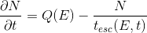
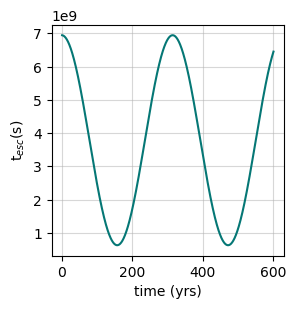
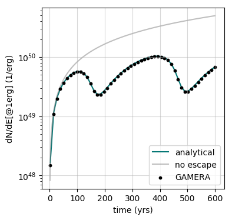
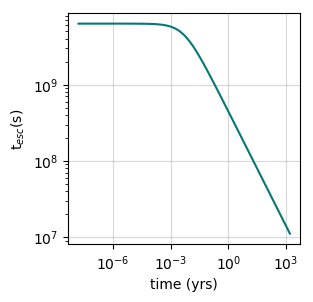
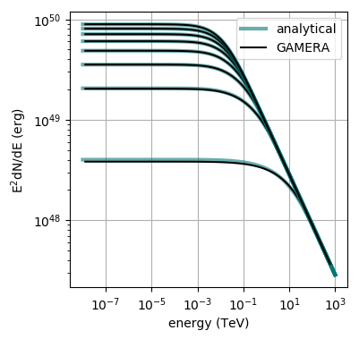
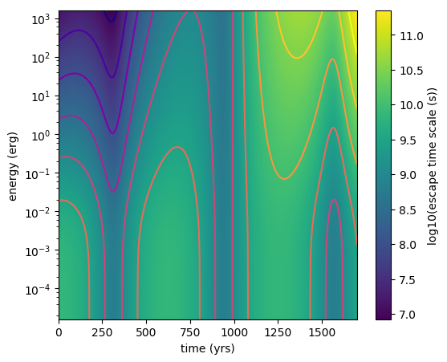
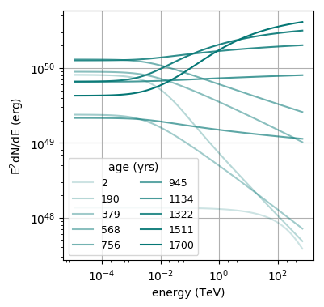
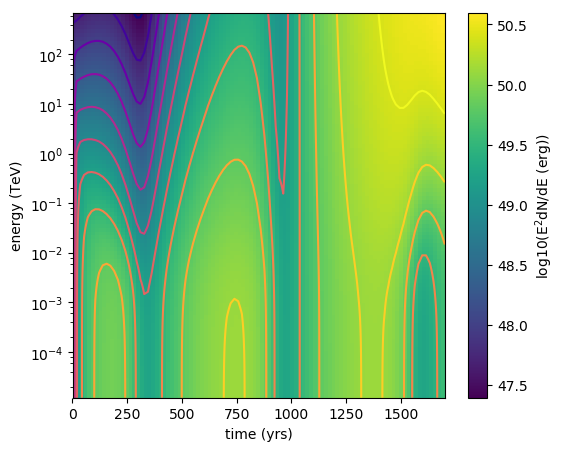

[(one page up)](tutorials_main.md)

# Modeling Particle Escape

There are different ways to implement the process of particles escaping the 
model system with `GAMERA`. The escape is characterised by a time scale which 
describes the time a particle is contained in the system, in the following 
referred to as the `escape time-scale`. 

The four different possibilities to model particle escape with `GAMERA` are assuming 
- 1. Time- and Energy-Constant Escape Time Scale
- 2. Energy-Constant but Time-Dependent Escape Time Scale
- 3. Time-Constant but Energy-Dependent Escape Time Scale
- 4. Both Time- and Energy-Dependent Escape Time Scale

In the following, for simplicitly we look at the solution of the transport equation 
 

 
without losses, i.e. _b=0_ and a stationary injection, _Q(E,t)=Q(E)_ 
and therefore
 

 
Of course you can use all the available methods for $$Q$$ and $$b$$ also when you 
include particle escape, but for this tutorial it is probably better to simplify 
and isolate the particle escape behaviour.

## 1. Time- and Energy-Constant Escape Time Scale

The easiest conceivable situation is a single escape time-scale that doesn't change 
with time and is constant for particles of all energies, $$t_{esc}(E,t) = t_{esc}$$. 
This scenario can be modeled in a `Particles`-object, here assuming protons, via 
```
pa = gp.Particles()
pa.SetConstantEscapeTime(t_esc)
pa.SetAge(age)
pa.CalculateProtonSpectrum()
```
This will result in an overall decline in the particle number with the same 
relative amplitude over the whole energy range. 
The analytical solution to equation (i) is 
$$ N(E,t) = Q(E) \cdot t_{esc} (1 - e^{-t/t_{esc}})$$ 
 
The amplitude evolution of the differential particle spectrum at E=1erg is shown here: 
(produced with [this](setup_escape_constant.py) script) 


## 2. Energy-Constant but Time-Dependent Escape Time Scale

Here, the relative loss is still the same at all energies of the system, but 
the loss time scale may vary over time. This can be implemented in `GAMERA` as follows: 
```
t = np.linspace(tmin,tmax,1000) # define an increasing set of times
t_esc = t_esc_0 * (np.cos(t / t_dash)**2+0.1) # define a custom function in time
t_esc_lookup = list(zip(t,t_esc)) # zip them to make a 2D-vector
pa.SetTimeDependentEscapeTime(t_esc_lookup) # set it up
# (rest identical to above)
```

The analytical solution of (i) to this problem is 
$$N(E,t) = Q(E)\cdot e^{-\int_1^t\frac{1}{t_{esc}(\tau)}d\tau}\left( \int_1^t e^{\int_1^\tau\frac{1}{t_{esc}(\eta)}d\eta}d\tau - \int_0^1 e^{\int_1^\tau\frac{1}{t_{esc}(\eta)}d\eta}d\tau\right)  $$
 
The escape time scale evolution in this example is shown here 

 
and the resulting time evolution of the differential particle density at E=1erg looks 
like this: 

 
The above plot has been generated with [this script](setup_escape_time_dependent.py).

## 3. Time-Constant but Energy-Dependent Escape Time Scale

In this case the time scale for particle loss stays the same over time but has 
a spectral dependence.
```
e = np.logspace(-8,3,100) * gp.TeV_to_erg # define a set of points in energy
t_esc = t_esc_0 * (1+e/e_dash)**-0.5 # define custom function in energy
t_esc_lookup = list(zip(e,t_esc)) # zip them to make a 2D-vector
pa.SetEnergyDependentEscapeTime(t_esc_lookup)
# (rest identical to above)
```

The analytical solution in this case is identical to the constant escape time scale 
described in section 1 with the exception that now $$t_{esc} = t_{esc}(E)$$. 
While the temporal evolution at each energy point resembles the shape shown in 
section 1, the energy dependence of the escape time scale changes the spectral 
shape of the evolving particle distribution. 

The shape of the escape time scale in energy looks like this 

 
and the resulting spectral evolution of the particle population is shown here: 

 
You can reproduce these plots with [this script](setup_escape_energy_dependent.py).


## 4. Both Time- and Energy-Dependent Escape Time Scale

It is also possible to implement an escape time that changes both with time and 
energy. There are to possibilities to implement this. 
 
### Method A: Fill a 2D-Vector
For this, a 2D-vector has to be created, consisting of 3 columns:
- 1st column: time (in years)
- 2nd column: energy (in erg)
- 3nd column: escape time scale (in s)

Here is an example:
```
lookup = []
for ee in e:
    for tt in t:
        lookup.append([tt,ee,t_esc(ee,tt)])
pa.SetTimeAndEnergyDependentEscapeTime(lookup)
```
Note that the loop order is important - the outer loop has to be over the 
energy bins of the escape time function, the inner one over the time bins. 
You can define any arbitrary escape time function. 
 
### Method B: Using A `numpy`-Style Mesh

This method is especially useful for numpy users. Here, you have to provide 
a mesh-grid as well as time and energy vectors:
```
t_m, e_m = np.meshgrid(t,e)
fp.SetTimeAndEnergyDependentEscapeTime(t,e,t_esc(e_m,t_m))
```
Here it is important that the x-coordinate is time in years and the y-coordinate 
is energy in erg. 
 
In this example, 
$$ t_{esc}(E,t) = t_{esc,0}\cdot (1+E/E')^{-0.5(1-0.2\cdot t/t')} \cdot (cos(t/t')^2 + 0.1)$$, 
where $$E' = 5\mathrm{GeV}$$ and $$t_{esc,0} = t' = 200 \mathrm{yrs}$$. This looks like this: 

 
The particle spectrum evolution can be seen here 

 
and here: 


 
These plots were created with [this script](setup_escape_energy_time_dependent.py).

[(one page up)](tutorials_main.md)

