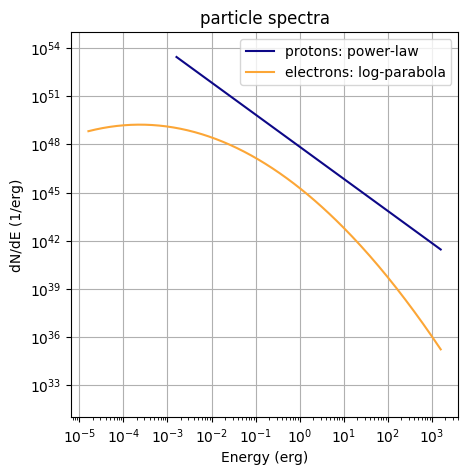

[(one page up)](tutorials_main_page.md)

Step-by-step: broad-band radiation spectrum from a parent population of particles
=================================================================================

Only a few steps are required to get the radiation spectra from a particle population.
A complete working script can be found [here](radiation_basics.py) (it creates the plots
at the bottom of the page). 

Step 1: Define a particle spectrum
----------------------------------

Create a 2D vector (C++) or list / numpy array (python) representing a particle spectrum. This spectrum has to be differential in energy (`1 / erg`). For instance, a power-law can be defined like
```
e = np.logspace(-3,3,200) * gp.TeV_to_erg # energy axis
power_law = norm * e**-alpha # define power law
particles = zip(e,power_law) # input needs to be 2D-array
```
>Note:
>You have to make sure that the `norm` of the power-law is right. For example, if
you normalise to an energy content `E_tot`, it should be something like `norm = E_tot / np.sum(e[1:]*powerlaw[1:]*np.diff(e))`.


Step 2: create a Radiation object and set it up
-----------------------------------------------
```
fr = gp.Radiation() # create the object
```

Step 3: Define relevant model parameters
----------------------------------------
```
b_field = 1e-5 # in Gauss, necessary for Synchrotron calculation
ambient_density = 1 # 1/cm^3, necessary for Bremsstrahlung and hadronic emission
# radiation field parameters, necessary for Inverse-Compton radiation. 
temp = 2.7 # Temperature in K
edens = 0.25 * gp.eV_to_erg # energy density in erg / cm^-3
distance = 1e3 # in pc
```

Step 4: Set up the Radiation object with these parameters
---------------------------------------------------------
```
fr.SetAmbientDensity(ambient_density)
fr.SetBField(b_field)
fr.AddThermalTargetPhotons(t_cmb,edens_cmb)
fr.SetDistance(distance)
```

Step 5: Set up the particle spectrum 
------------------------------------
You can decide what kind of particles you put. This will determine which radiation processes will be calculated.
```
fr.SetProtons(particles) 
fr.SetElectrons(particles) 
```

Step 6: Calculate the radiation spectra and retrieve them
---------------------------------------------------------
The differential spectrum is calculated at a specified set of points in energy 
space. The unit of these points in energy is erg. This set of points is 
defined by a 1D-vector (`C++`) or list / numpy array (`python`), for example:
```
e = np.logspace(-6,15,bins) * gp.eV_to_erg # has to be in erg!
```
The radiation spectrum is calculated at these energies via 
```
fr.CalculateDifferentialPhotonSpectrum(e)
```

Step 7: Get the spectra
-----------------------
There are different formats you can now extract:
- differential photon spectra (`dN/dE`, units: `1 / erg / cm^2 / s`)
```
fr.GetTotalSpectrum()  # sum of all components
fr.GetPPSpectrum() # inelastic proton scattering
fr.GetSynchrotronSpectrum()# synchrotron radiation
fr.GetBremsstrahlungSpectrum() # bremsstrahlung
fr.GetICSpectrum() # inverse-compton scattering
```
   
- SEDs (`E^2*dN/dE`, units: `erg / cm^2 / s`) 
```
fr.Get*SED() # * denotes the radiation mechanisms above!
```
- integrated flux (`int_e^inf dE dN/dE`, units: `1 / cm^2 / s`)
```
fr.GetIntegral*Flux(emin,emax) # emin, emax in TeV!
```
- integrated energy flux (`int_e^inf dE E*dN/dE`, units: `erg / cm^2 / s`)
```
fr.GetIntegral*EnergyFlux(emin,emax) # emin, emax in TeV!
```

The so-retrieved spectra are in the format of 2D-vectors (C++) or 2D-lists (python). 
 
Important Notes
---------------
- Specifying a distance value is optional. If set to non-zero value, photon flux from particle population at that distance will be calculated. Otherwise, the luminosity is calculated. 

- For integral fluxes to be precise, you should make sure that your spectrum's 
binning is fine enough (you can change that by adjusting `bins` in the above step `[a]`). 
You can get an idea of the required binning [here](binning.md). 

- You only have to set the parameters relevant to the radiation process you want to calculate. For example, if you are only interested in Bremsstrahlung, you don't have to specify the B-Field

- For the IC process there are several ways to set up the radiation fields, including for SSC modelling or anisotropy, [see here](inverse_compton.md)

- There are different hadronic interaction models that you can choose from. See [here](hadronic_models.md) how to do it!

- If you have set up more than one IC target field, you can access the individual contributions to the resulting radiation spectrum via `fr.GetICSpectrum(field)`,
where `field` is the index of the field (e.g. the for the first field you have set 
it is `field=0`, for the second `field=1` and so on).

- The `Particle` class in `GAMERA` creates spectra already in the right format and 
is the natural 'counterpart' to the Radiation class. It allows, among other things, 
for time-dependent modeling. Tutorials how to use it are available, too.


 

 

[(one page up)](tutorials_main_page.md)
