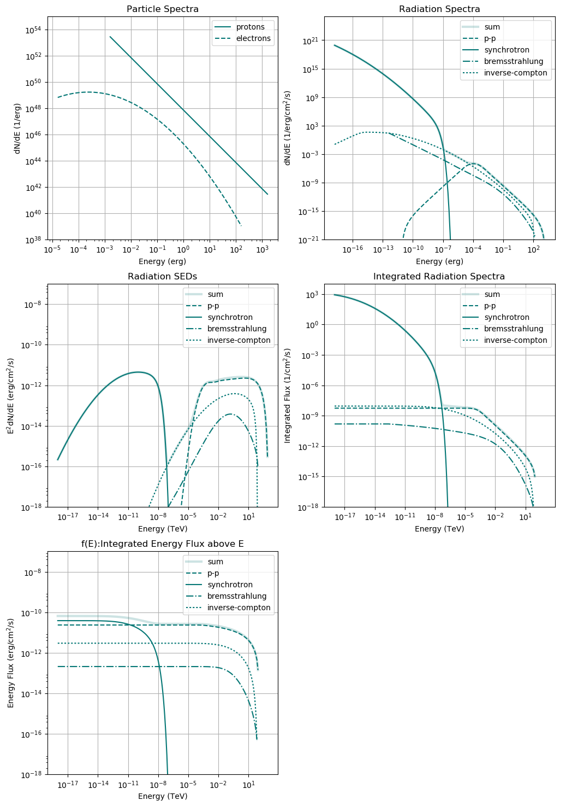

Calculating the broad-band radiation spectrum from a parent population of particles
===================================================================================

In GAMERA, radiation mechanisms are implemented for
- Electrons (including Positrons)
- Protons (actually assuming a generic hadron mix, see ...)
- Arbitrary mix of hadronic species for both projectiles and target nuclei. 

Supported gamma-ray production mechanisms:

- Electrons

For the radiation from electrons, GAMERA supports the following emission mechanisms:

__Synchrotron Emission__
 
Supports both isotropised pitch angle distribution of electrons (following Ghisellini et al., ApJ, Part 2 - Letters (ISSN 0004-637X), vol. 334, Nov. 1, 1988, p. L5-L8) as well as custom fixed pitch angles (Blumenthal & Gould, RvMP, vol. 42, Issue 2, pp. 237-271, 1970)

__Bremsstrahlung__

Both electron-electron and electron-ion Bremsstrahlung, following Baring 1999, ApJ, 513, 311-338

__Inverse-Compton Emission__
Supports arbitrary target fields, using the full Klein-Nishina cross-section following Blumenthal & Gould 1970 also SSC emission supported

- Hadrons

__π⁰- and η-Decay__ 
Following the parameterisation of Kafexhiu et al., Physical Review D, 
Volume 90, Issue 12, id.123014, 2014. 
 
There are several tutorials that you can access at the top bar of this page which 
will teach you how to use the `Radiation` class.

General Usage
-------------


The following will explain the general usage of the `GAMERA Radiation` class. 
Syntax is in python (wrapped via swig from C++), but the principle of usage
is the same in C++. 

A complete working script can be found [here](RadiationBasics.py). 

- __define a particle spectrum__

The first step is to define a 2D vector (C++) or list / numpy array (python) 
defining a particle spectrum. This spectrum has to be differential in energy. 
How this spectrum is computed doesn't matter as long as it is in the right 
units and format. The spectrum has to be a vector or list of {energy, differential 
particle number} tuples. The energy has to be in erg, and the differential particle 
number has to be in particles / erg . 

For instance, a power-law can be defined in python using numpy as simply as
```
# define the energy range of the particles, here between 1 GeV and 1 PeV
energy_in_erg_particles = np.logspace(-3,3,200) * gp.TeV_to_erg

# make the power-law, norm has to be in the right format so that it reflects
# particles  /  energy in ergs
particles = norm * energy_in_erg_particles**-alpha

# zip together to a 2D-list
particles = np.array(zip(energy_in_erg_particles,particles))
```
The units of the spectrum will impact the unit of the calculated radiation spectra. 
For instance, if the unit of the particle spectrum only differential in energy, 
i.e. 1/erg, the output radiation spectra will have the unit of a flux if a 
source distance is specified (see below) or differential photon count per energy and time if not. 

On the other hand, if the input unit is differential also in volume, i.e. 1/erg/cm^3, 
then also the output radiation spectrum will be. Therefore, if no distance is 
specified in this case, a volume photon emissivity will be calculated, i.e. d³N/dEdVdt. 

The `Particle` class in `GAMERA` creates spectra already in the right format and 
is the natural 'counterpart' to the Radiation class. It allows, among other things, 
for time-dependent modeling. Tutorials how to use it are available, too.


- __create a Radiation object and set it up__

Creating a Radiation object works like
```
fr = gp.Radiation()
```

Define relevant parameters
```
b_field = 1e-5 # in Gauss, necessary for Synchrotron calculation

ambient_density = 1 # 1/cm^3, necessary for Bremsstrahlung and hadronic emission

# radiation field, necessary for Inverse-Compton radiation. 
temp = 2.7 # Temperature in K
edens = 0.25 * gp.eV_to_erg # energy density in erg / cm^-3

# distance
distance = 1e3 # in pc

```

and set up the Radiation object with these parameters

```
fr.SetAmbientDensity(ambient_density)
fr.SetBField(b_field)
fr.AddThermalTargetPhotons(t_cmb,edens_cmb)
fr.SetDistance(distance)
```
_Some remarks:_ 

- you only have to set the parameters relevant to the radiation process you want to calculate. For example, if you are only interested in Bremsstrahlung, you don't have to specify the B-Field

- For the IC process there are several ways to set up the radiation fields, including for SSC modelling. There is a [https://www.mpi-hd.mpg.de/personalhomes/jhahn/Tutorials/Calculate%20Radiation%20From%20A%20Particle%20Population/Setting%20Up%20IC-Target%20Photons/index.html](dedicated tutorial for that).

- Specifying a distance value is optional. If set to non-zero value, photon flux from particle population at that distance will be calculated. Otherwise, a photon emissivity / production rate is calculated. In the following, we assume that a distance has been set, but the  procedure to calculate radiation spectra is the same if you don't chose to do so.

Finally, set up the particle spectrum. Now, you can decide what kind of particles 
you want to set. In the standard way of using it, you can pick one or both of those 
options depending on what kind of radiation processes you are interested in. Or, 
in other words, what kind of particles you theoretical spectra constitute:

```
fr.SetProtons(particles)   # if you want to calculate hadronic emission
fr.SetElectrons(particles) # if you want to calculate leptonic emission 
   # (Bremsstrahlung, Synchrotron- and IC-radiation)
```

--- calculate the radiation spectra and retrieve them
The differential spectrum is calculated at a specified set of points in energy 
space. The unit of these points in energy is again erg. This set of points is 
defined by a 1D-vector (`C++`) or list / numpy array (`python`), for example:
```
e = np.logspace(-6,15,bins) * gp.eV_to_erg #[a]
```
Then, the radiation spectrum is calculated via 
```
fr.CalculateDifferentialPhotonSpectrum(e)
```

The now calculated spectra can be accessed in form of either  
differential photon spectra (dN/dE, unit: $$erg^{-1} cm^{-2} s^{-1} \text{ vs. } erg$$) or 
SEDs (E$$^2$$dN/dE, unit: $$erg \cdot cm^{-2} s^{-1} \text{ vs. } TeV$$). 
The commands are as follows: 
 
__differential photon spectra__

```
fr.GetPPSpectrum() # inelastic proton scattering
fr.GetSynchrotronSpectrum()# synchrotron radiation
fr.GetBremsstrahlungSpectrum() # bremsstrahlung
fr.GetICSpectrum() # inverse-compton scattering
fr.GetTotalSpectrum()  # sum of all components
```
 
__SEDs__

```
fr.GetPPSED() 
fr.GetSynchrotronSED() 
fr.GetBremsstrahlungSED()
fr.GetICSED()
fr.GetTotalSED()
```
The so-retrieved spectra are in the format of 2D-vectors (C++) or 2D-lists (python). 
 
__integrated flux__ 

also integrated number fluxes (integrated in energy over `dN/dE`) are easily calculated via
```
fr.GetIntegralTotalFlux(emin,emax) # emin, emax in TeV!
fr.GetIntegralPPFlux(emin,emax) 
fr.GetIntegralSynchrotronFlux(emin,emax)
fr.GetIntegralBremsstrahlungFlux(emin,emax)
fr.GetIntegralICFlux(emin,emax)
```
These values are floats and correspond to the integral fluxes between emin and emax in TeV. The result has then the unit of `1 / cm^2 / s`.
 
__integrated energy flux__

same as above for energy fluxes (integrated in energy over `E*dN/dE`)
```
fr.GetIntegralTotalEnergyFlux(emin,emax) # emin, emax in TeV!
fr.GetIntegralPPFlux(emin,emax) 
fr.GetIntegralSynchrotronFlux(emin,emax)
fr.GetIntegralBremsstrahlungFlux(emin,emax)
fr.GetIntegralICFlux(emin,emax)
```
The result has then the unit of `erg / cm^2 / s`. 
For these integral fluxes to be precise, you should make sure that your spectrum's 
binning is fine enough (you can change that by adjusting `bins` in the above step `[a]`). 
You can get an idea of the required binning [https://www.mpi-hd.mpg.de/personalhomes/jhahn/Various/Integration%20Over%20Power-Laws/index.html](here). 


 

