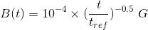
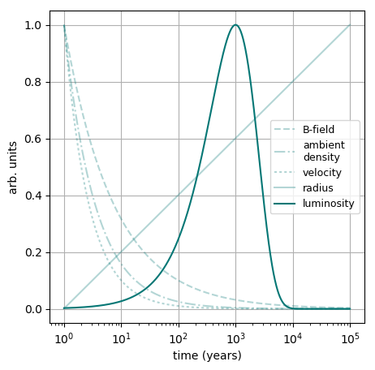
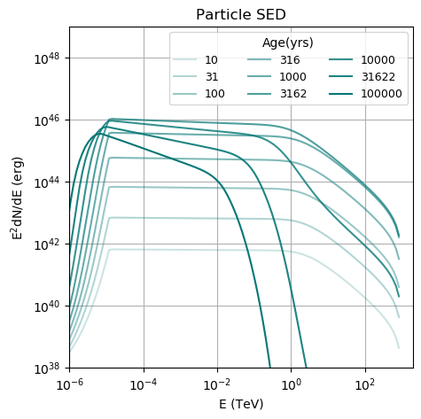

[(one page up)](tutorials_main.md)

# Time-Dependent Modeling

Time-dependent modeling, i.e. modeling the spectral evolution of sources while 
physical parameters like magnetic fields are changing over time, can be performed with `GAMERA` in much the same way as static modeling described [in a this tutorial](time_independent_modeling.md), so please go through that one first if you haven't already!

## Energy-independent parameters
If you want to model the time-dependency of energy-independent parameters such as the ambient magnetic field or gas density the only difference to the time-independent procedure is to provide 2D-vectors instead of doubles to the corresponding `Setter`-functions you have. 

These vectors need to constist of two columns, with the first column holding the 
time steps and the second the value of the environmental parameter at that time. 
For instance, if you wanted to define a magnetic field declining with time as 
 

 
you would have to implement this like that:

```
fp = Particles()
t_ref = 100
time_steps = np.logspace(1,4,100) #in years
b = 1e-4 * (time_steps / t_ref) ** -0.5 #in Gauss
b_lookup = zip(time_steps,b)
fp.SetBField(b_lookup)
```

This simple implementation works with
- ambient density (`fp.SetAmbientDensity(dens)`)
- the injection luminosity, i.e. the normalisation of the injection spectrum  (`fp.SetLuminosity(dens)`)
- expansion velocity and radius (`fp.SetExpansionVelocity(vel)`, `fp.SetRadius()`)
- a slightly different nomenclature in case of time-dependent but energy-independent particle escape times, here an example:
```
t_esc_0 = 1000 * gp.yr_to_sec # in seconds
t_esc = t_esc_0 * (time_steps / t_ref) ** 0.5
t_esc_lookup = zip(time_steps)
fp.SetTimeDependentEscapeTime(t_esc_lookup)
```
## Energy-dependent parameters
For energy-dependent parameters, the method of applying time-dependency
is different:
- If the particle escape time scale depends both on energy and time, also the spectral shape can be made to change with time, see [here](particle_escape.md).

- If not only the injection spectrum normalisation (luminosity) but also its spectral shape, this can be modeled [following these steps](tt.md) 

- Currently time-dependent radiation fields are only possible via an iterative
approach. There is an [extra tutorial on iterating](iteration.md).

A working script can be found [here](particles_time_dep.py), which will output the following plots: 

Temporal evolution of the particle spectrum assuming the following time dependences 
(escape time not set in this example): 
 




[(one page up)](tutorials_main.md)
