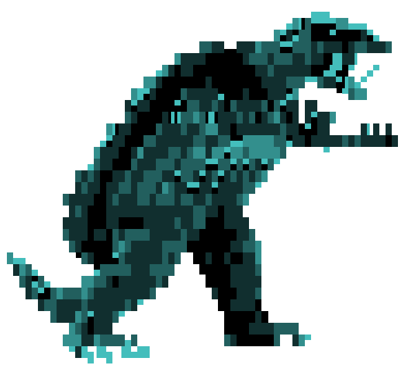

[(back to main page)](main_page.md)

Tutorials
=========


How to ...

- [calculate the broad-band radiation spectrum from a parent population of hadrons or electrons](radiation_modeling.md)
- [evolve a particle population in a time-constant environment](time_independent_modeling.md)
- [evolve a particle population in a changing environment](time_dependent_modeling.md)
- [set up more complicated Inverse-Compton radiation fields (SSC, anisotropy, arbitrary shape)](inverse_compton.md)
- [pick your hadronic interaction model](hadronic_models.md)
- [take particle escape into account](particle_escape.md)
- [display the particle energy loss scales](energy_loss.md)
- [Take into account gammagamma absorption](gammagamma_absorption.md)
- [Calculate the emission for arbitrary cosmic ray and ambient medium composition](hadronic_components.md)
- [Fitting data with GAMERA models](fitting_data.md)

Please note:
------------
 
At the time of writing, `python` is quite popular and the tutorials are provided in that 
language. However, you can use `GAMERA` also in your `C++` program by adapting 
the syntax, e.g. instead of the `python` code
```
fr = gappa.Radiation()
fr.SetBField(b)
[...]
sed = fr.GetTotalSED()
```
you could write in `C++` syntax
```
Radiation *fRad = new Radiation();
fRad->SetBField(b);
[...]
vector< vector<double> > SED = fRad->GetTotalSED();
```
Please check out the [installation instructions](download_installation.md) to learn how to make `GAMERA` work
in either language.

 

[(back to main page)](main_page.md)
