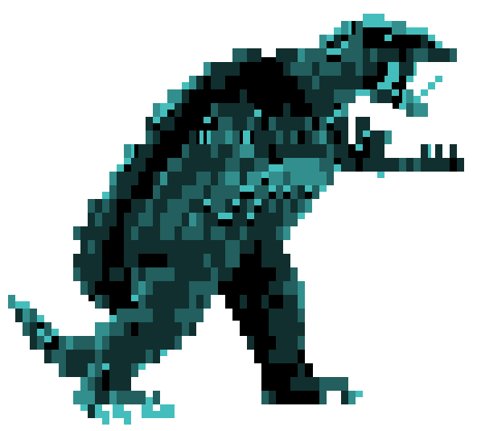

[(back to main page)](/docs/main_page)

Tutorials
=========


How to ...

- [calculate the broad-band radiation spectrum from a parent population of hadrons or electrons](/docs/radiation_modeling)
- [evolve a particle population in a time-constant environment](/docs/time_independent_modeling)
- [evolve a particle population in a changing environment](/docs/time_dependent_modeling)
- [set up more complicated Inverse-Compton radiation fields (SSC, anisotropy, arbitrary shape)](/docs/inverse_compton)
- [pick your hadronic interaction model](/docs/hadronic_models)
- [take particle escape into account](/docs/particle_escape)
- [display the particle energy loss scales](/docs/energy_loss)
- [Take into account gammagamma absorption](/docs/gammagamma_absorption)
- [Calculate the emission for arbitrary cosmic ray and ambient medium composition](/docs/hadronic_components)
- [Fitting data with GAMERA models](/docs/fitting_data)

Please note:
------------
 
At the time of writing, `python` is quite popular and the tutorials are provided in that 
language. However, you can use `GAMERA` also in your `C++` program by adapting 
the syntax, e.g. instead of the `python` code
```
fr = gappa.Radiation()
fr.SetBField(b)
[...]
sed = fr.GetTotalSED()
```
you could write in `C++` syntax
```
Radiation *fRad = new Radiation();
fRad->SetBField(b);
[...]
vector< vector<double> > SED = fRad->GetTotalSED();
```
Please check out the [installation instructions](/docs/download_installation) to learn how to make `GAMERA` work
in either language.

 

[(back to main page)](/docs/main_page)
