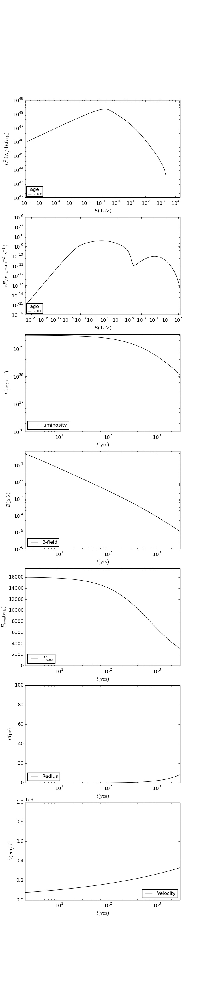

Level 5: The PWN model by Martin et al. 2012
============================================

Now we have learned everything that is needed for writing a real time-dependent 
astrophysical source model. In the following, the model by Martin et al. 
(Martin J., Torres D. F., & Rea N. 2012, MNRAS 427, 415),
(Torres, D. F., Cillis, A., Martin, J., & de Ona Wilhelmi, E. 2014,
Journal of High Energy Astrophysics, 1, 31).

Again, ``python``-script and parameter file are located in the 
``docu/tutorial/`` directory.

In principle, the whole model-specific physics is in the function that fills
the parameter lookups, and so changing this function is all that has to be changed.
To that end, we replace the ``GetSpindownStuff`` function from level 4 by 

  .. sourcecode:: python

    def CalculateTimeDependentStuff():
      t = np.logspace(0,math.log10(1.e6*age),80)
      gammap = 1.3333
      vej = math.sqrt(10.*e0/(3.*mej))
      c = math.pow((6./(15.*(gammap-1.)))+289./240.,-0.2);

      lum = (1.-etab)*lum0*(1.+t/tc)**(-1.*(brind+1.)/(brind-1.))
      emax = 3.*eps*gamerapy.el_charge*np.sqrt(etab*lum/((1.-etab)*gamerapy.c_speed))
      r = c*(lum0*t*gamerapy.yr_to_sec/e0)**0.2 * vej*t*gamerapy.yr_to_sec
      v = 1.2*r/(gamerapy.yr_to_sec*t)
      b = np.sqrt(gamerapy.yr_to_sec*etab*6./r**4 * np.concatenate(([0], ((lum * r)[1:] * np.diff(t)).cumsum())))

      lum = np.vstack((t, lum)).T
      b = np.vstack((t, b)).T
      emax = np.vstack((t, emax)).T
      r = np.vstack((t, r)).T
      v = np.vstack((t, v)).T

      return lum, b, emax, r, v

  .. warning::
    
     Due to calculation speed reasons, the maximum particle energy is currently 
     capped to 10 PeV if you call the grid solver (i.e. in the case of time-dependent
     energy losses).

 - these additional commands have to be used in order to get the Synchtroton-Self-Compton (SSC)
   component and to set the source radius and extension velocity parameter lookups:

  .. sourcecode:: python

    fp.SetRadiusLookup(r)
    fp.SetVelocityLookup(v)
    fr.SetSSCTargetPhotons(fp.GetRadius())

.. hint::

   In this example, the SSC target field is *not* used for calculating the energy
   losses. To remove this caveat you have to iterate in time and pass the
   SSC radiation field to the particles object in each step.

The calculation will take a couple of minutes because the B-field strength and
maximum electron energies are insane at times earlier than several hundreds of
years

  .. note:: 
    
    If the computation is slow, there are several ways to compromise.

    **1. Reduce the number of energy bins**
       
     - (see tutorial level 4 for an explanation)

    **2. Use the** ``SetCriticalMinEnergyForGridSolver`` **Particle class method:**

     - The grid solver automatically determines the starting time of the 
       iteration ``tmin``. Particles injected before ``tmin`` are treated as 
       being injected as a single blob.
       This blob of particles will slide down in energy over time and end up
       at some energy ``E`` after ``t=age``. Now, the grid solver automatically 
       choses ``tmin``
       as the starting time so that the blob ends up at a desired energy ``Ed`` after
       ``t=age``. The default is ``Ed=1.e-3 erg``, but you can set a manual 
       value like ``fp.SetCriticalMinEnergyForGridSolver(1.e-2)`` which would 
       set ``Ed=1.e-2 erg``. As a result, ``tmin`` becomes larger, and in systems
       where the B-field decreases with time, your electron energy losses at the beginning of 
       the evolution are smaller which in turn increases the computational speed
       (see tutorial level 4).
       The same effect is achievable by setting a high value of Emin, e.g.
       ``fp.SetEmin(1.e-2)``. Choose this options when you can live with this
       bump - this is typically true when you are only interested in VHE
       emission and even a high bump in electrons doesn't matter as you are looking
       at the emission from TeV particles.

    **3. Decrease the number in your lookups to a minimum**
 
     - This makes the binary search in the lookups faster!

    **4. Appoximate with constant losses**

     - If the time-changes in the loss-governing parameters (i.e. B-field, 
       ambient density, source radius and extension speed) are slow, you could
       approximate with a model where these values are static. In other words,
       approximate with something like the model you got to know in level 3.

Et voila:

